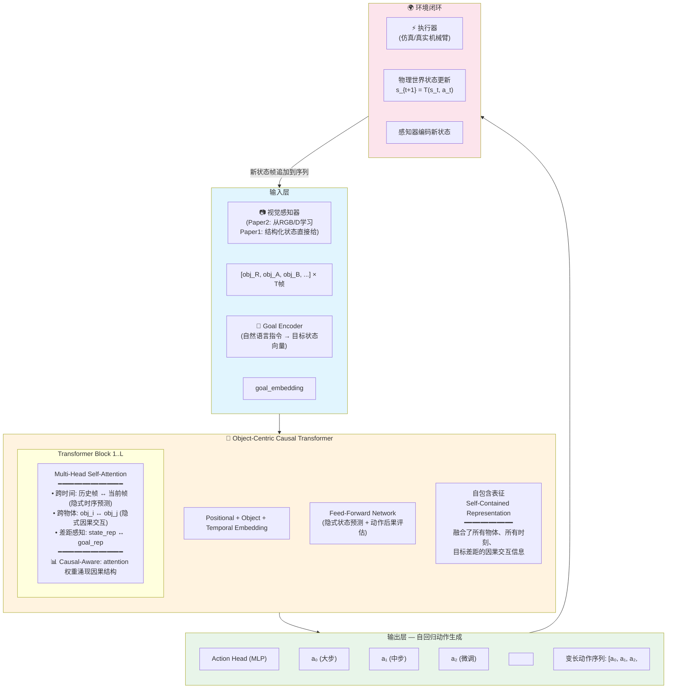
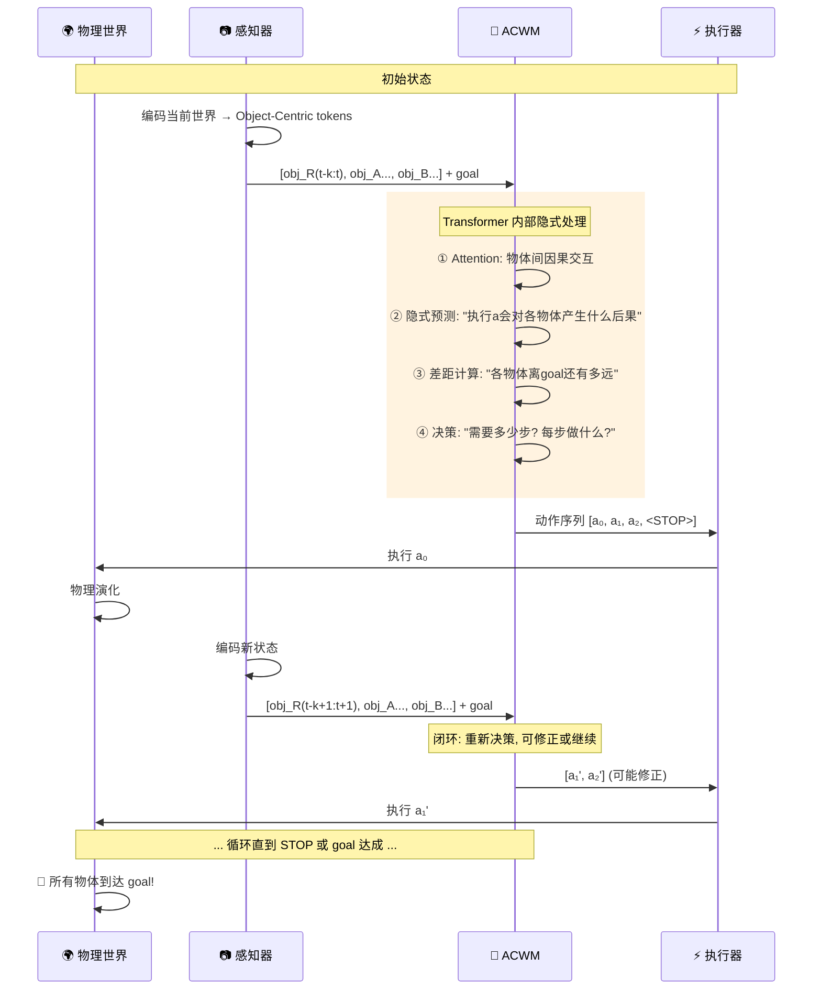
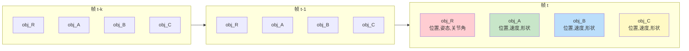
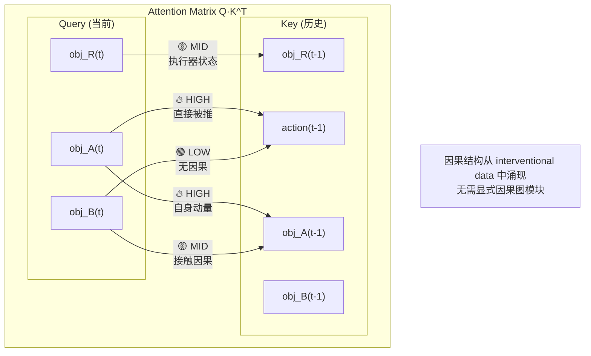
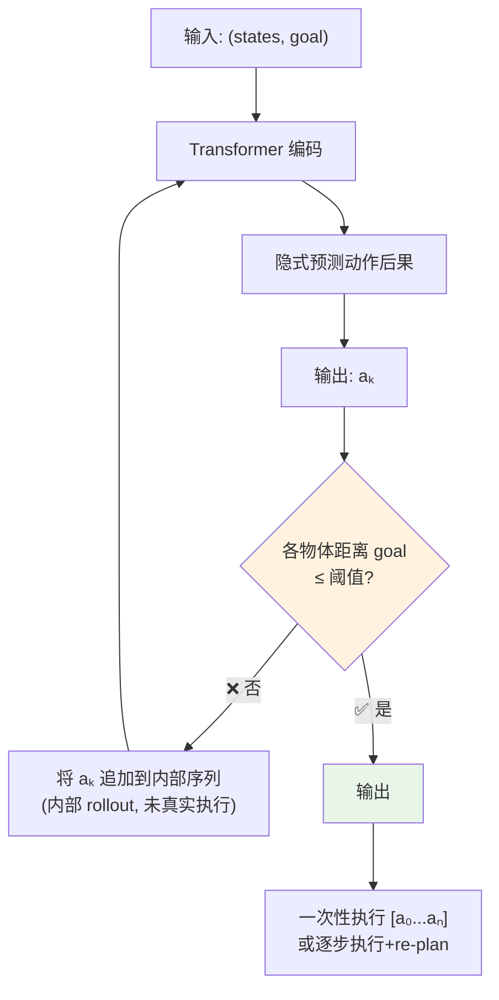
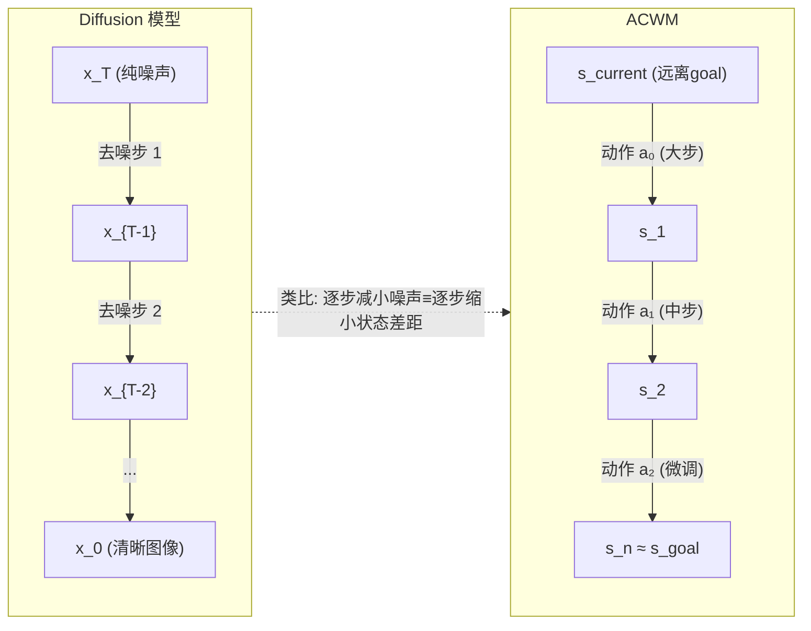
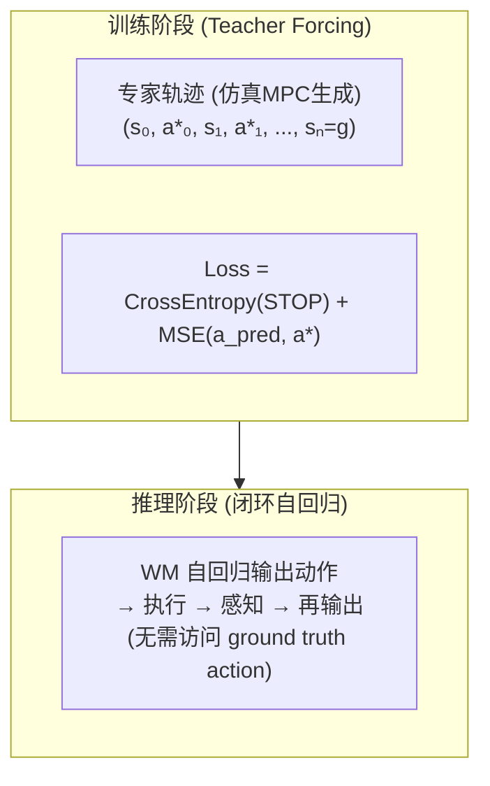

# ACWM — Action-Centric World Model 架构图

> 工作名称: ACWM | 别名候选: OCAM / CAWM / ART / GATOR  
> 日期: 2026-05-19 | 作者: brucewu

---

## 总览

---

## 核心闭环 (Action-Perception Loop)

---

## Object-Centric Token 结构

---

## Causal-Aware Attention 示意

---

## 自适应步数机制

---

## Diffusion 类比视角

---

## 训练范式

---

## 与 CJEPA 的核心差异

| 维度 | CJEPA | ACWM (本设计) |
|------|-------|--------------|
| **任务目标** | 预测 latent 状态 | 输出动作 |
| **表征方式** | 全局 latent | Object-Centric tokens |
| **因果推理** | 无显式设计 | Attention 涌现因果结构 |
| **输出** | next latent state | action sequence + STOP |
| **误差处理** | 预测误差累积 | 闭环执行→纠错 |
| **步数** | 固定 horizon | 自适应 STOP |
| **泛化关键** | 通用 latent 空间 | Object-level 组合泛化 |
| **哲学** | "先理解世界，再行动" | "理解和行动一体" |

---

## 消融实验设计

| 消融项 | 预期效果 |
|--------|---------|
| – Object-Centric (改为扁平 state vector) | 物体数量 OOD 退化 |
| – STOP 机制 (固定 horizon) | 长 horizon 任务退化 |
| – Causal-Aware (随机 shuffle attention) | 因果场景退化, 伪相关增加 |
| – 闭环 (改为 open-loop) | 物理参数 OOD 退化 |
| – 自适应步长 (固定 step size) | 效率下降, 微调能力退化 |

---

*Last updated: 2026-05-19 | Next: 细化各模块的实现细节*
