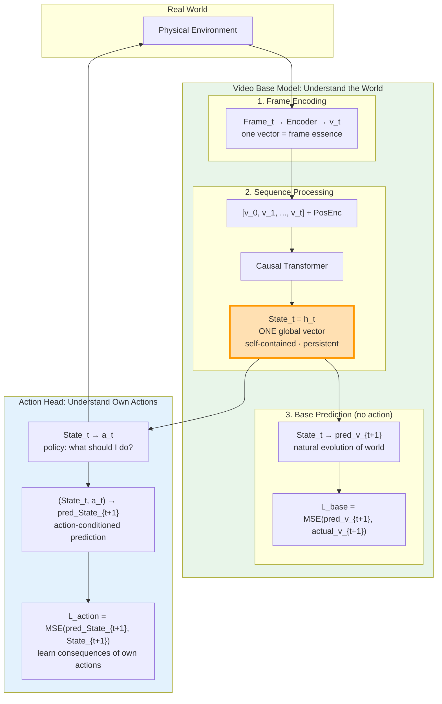

# FTWM — Frame-as-Token World Model 最终架构定稿

> 日期: 2026-05-20  
> 作者: brucewu + Paper1  
> 定位: Paper2 基座世界模型  
> 状态: ✅ 架构已确认

---

## 0. 一天讨论的结论

今天从 ACWM 出发，经过 SCWM → 四条路径 → 帧本质 → 动作解耦，最终收敛到 **FTWM**：

- 每帧压缩为**一个向量**（帧本质），不是 N 个 slot
- 帧向量序列通过 Causal Transformer 交互 → **一个全局 State_t**
- Base model 做 **next-frame prediction（无动作）**，学习世界自然演化
- Action head 从 State_t **解耦出动作**，独立学习干预后果
- Slot 是**可选的下游解码**，不是架构基础

---

## 1. 总览架构



---

## 2. 两层预测的因果含义

```
                    自然演化预测         干预后果预测
                    (Base Model)        (Action Head)
                    
  State_t ──────────→ pred_v_{t+1}      
    │                                   
    │                差异 = 动作的因果效应
    │                                   
    └──→ a_t ──→ pred_State_{t+1}
    
  如果 pred_v_{t+1} (自然) ≠ pred_State_{t+1} (干预):
    → 动作 a_t 确实改变了世界
    → 差异量化了动作的 causal effect
```

这是**因果推断的自然框架**：自然演化 vs 干预演化，两者之差 = 因果效应。

---

## 3. Base Model 详解

```
输入: [Frame_0, Frame_1, ..., Frame_t]
       ↓ Encoder (ViT/CNN)
      [v_0, v_1, ..., v_t]          ← 每个 v_i 是帧本质向量
       ↓ + Position Encoding   
       ↓ Causal Transformer
      State_t = h_t                 ← 全局世界状态
       ↓ MLP
      pred_v_{t+1}                  ← 预测下一帧的本质

训练: L = MSE(pred_v_{t+1}, Encoder(Frame_{t+1}))
数据: 视频 (不需要动作标签)
```

**注意:** Encoder 是同一个，编码 Frame_{t+1} 得到 target。

---

## 4. Action Head 详解

```
输入: State_t (from Base Model)
       ↓ Policy MLP
      a_t                           ← 动作 (joint targets / delta pose)

输入: (State_t, a_t)
       ↓ Action-Conditioned Predictor
      pred_State_{t+1}              ← 预测执行 a_t 后的世界状态

训练: L = MSE(pred_State_{t+1}, State_{t+1})
      其中 State_{t+1} 来自 Base Model 编码真实下一帧
数据: 机器人操作数据 (state-action-state triplets)
```

**注意:** Action head 训练时，Base Model 的 State_t 可以是冻结的，也可以是联合训练的。

---

## 5. 推理闭环

```
Loop:
  1. Camera → Frame_t
  2. Base Model: [v_history, v_t] → State_t
  3. Action Head: State_t → a_t
  4. Execute a_t on robot
  5. World evolves → new Frame_{t+1}
  6. Goto 1
```

**和 LLM 的类比：**
- LLM: token → hidden → predict next token → append → repeat
- FTWM: frame → State_t → predict next frame → observe real → update → repeat

---

## 6. 设计哲学：Agent-Centric 世界模型

> 2026-05-23 新增 | brucewu 的核心洞察

### 6.1 世界模型不是空泛的预言机

传统的世界模型视角是"给一段视频/状态序列，预测接下来会发生什么"——这是一个**旁观者视角**。FTWM 的视角不同：

> 世界模型是以 **Agent 自身** 为中心的。模型不是问"世界会怎么变"，而是问"**我能让世界怎么变**"。

这个视角转换有深远后果。旁观者需要预测一切可能的变化——一阵风吹过、一块石头滚落、一个人走过。但 Agent 只需要预测**和自己行动相关**的那部分变化。

### 6.2 动作库 = Agent 的能力边界

每一个 Agent 都有一个**动作库（Action Library）**——它在这个物理形态下能执行的所有动作。

```
⛓️ 腿 → 能走、能跑、能跳
🦾 机械臂 → 能推、能抓、能放
✈️ 无人机 → 能飞、能悬停

动作库定义了 Agent 的 "能做空间"
世界模型只需要对这个空间内的动作做条件预测
```

**关键约束：模型不可能预测做不到的动作。**

只有腿的时候，不需要预测"飞"会产生什么后果——因为它根本不能飞。动作库限定了 WM 需要建模的 intervention 范围。

### 6.3 基座 + 动作核：两层结构

```
┌─────────────────────────────────────────┐
│  Video Base Model (视觉基座)             │
│  → 理解世界视觉规律（可以通用、可以大）    │
│  → 自然演化预测：风怎么吹、物体怎么滚       │
│  → 不绑定任何动作                         │
└─────────────────────────────────────────┘
                    ↓
┌─────────────────────────────────────────┐
│  Action Core (动作核心)                  │
│  → 给定状态 + 我的动作 → 预测后果         │
│  → 仅限于动作库内的动作                    │
│  → "这个状态下，我可以做什么来达到想要的状态" │
│  → 换机器人 = 换动作核，基座不变            │
└─────────────────────────────────────────┘
```

**基座回答"世界是什么"，动作核回答"我能对世界做什么"。**

### 6.4 动作不是预测出来的，是选出来的

这里有一个容易混淆的点：

| | 含义 | 谁做 |
|---|---|---|
| **动作预测**（action-conditioned prediction） | 给定 a_t，预测 s_{t+1} | World Model |
| **动作选择**（action selection / planning） | 选哪个 a_t 能到达想要的 s_{t+1} | Planner (MPC/MPPI/RL) |

WM 的任务是提供准确的**条件预测**：`f(s_t, a) → s_{t+1}`。
Planner 的任务是用这个预测函数来**搜索最优动作**。

分工：
- WM：知道每个动作的结果（理解世界）
- Planner：选最好的结果去执行（决策）

### 6.5 与 LLM 的统一视角

回到 LLM 的类比：

```
LLM:
  动作 = 选下一个 token（动作库 = 词表，~50000 种）
  预测 = 给定当前上下文 + token，预测下一个隐藏状态
  闭环 = 输出 token → 追加到上下文 → 继续

FTWM:
  动作 = 选下一个控制指令（动作库 = 机械臂可达空间）
  预测 = 给定 State_t + action，预测 State_{t+1}
  闭环 = 执行动作 → 观测新帧 → 更新 State → 继续
```

两者在数学上同构。核心差异只在：
1. **状态空间**：离散 token vs 连续帧向量
2. **动作空间**：词表 vs 连续控制空间
3. **闭环方式**：自回归追加 vs 物理世界反馈

但"基于当前状态预测不同动作的后果"这个核心逻辑，是一样的。

---

## 7. 与 C-JEPA 的对比（注：原第6节，编号已更新）

| | C-JEPA | FTWM |
|---|---|---|
| Frame encoding | Slot competition → K slots | One vector → frame essence |
| Representation | N slots (distributed) | ONE global State_t |
| Training objective | JEPA: context→target latent | Next-frame-essence prediction |
| Action handling | Not separated | Decoupled Action Head |
| Causal understanding | Object-level masking | Natural vs Intervention prediction gap |
| Data | Requires action for masking | Base: video only; Action: robot data |
| LLM analogy | BERT-like (bidirectional, slots) | GPT-like (autoregressive, single hidden) |

---

## 8. Slot 的地位

```
Base Model 的 State_t 是 ONE vector.

Slot decoding 是可选的下游操作:
  State_t → Slot Decoder → [s_0, s_1, ..., s_K]
  
用途:
  - 诊断: 验证 State_t 是否编码了物体结构
  - 可解释性: 可视化每个 slot 关注什么
  - 论文: 展示 "全局 State 可以解耦出物体信息"
  
但不是架构必须。C-JEPA 的 slot 是编码方式 (upstream)，
FTWM 的 slot 是解码产物 (downstream)。
```

---

## 9. 保留的探索线

| 线 | 说明 | 状态 |
|---|---|---|
| **FTWM (今日)** | Base Model + Action Head 解耦架构 | ✅ 主攻方向 |
| **ACWM (昨日)** | Action-Centric, 统一输出动作序列 | 🔄 并行探索 |
| **C-JEPA** | Paper2 baseline, 也在 SO-101 真机上测试 | 🔄 Baseline |
| **Paper1 三类 Encoder** | Flat/Object-Centric/Causal-Aware, 对接 MPC | ✅ 进行中 |

---

## 10. 最小可跑实现 (MVP)

### Phase 1: Structured State (Paper1 环境)

```
Base Model:
  obs_t (6 tokens × 16 dim) → MLP → v_t ∈ ℝ^128
  [v_0, ..., v_5] → Causal Transformer (L=2, d=256) → State_t ∈ ℝ^256
  State_t → MLP → pred_v_{t+1}
  L = MSE(pred_v_{t+1}, v_{t+1})

Action Head:
  State_t → MLP → a_t (delta pose)
  (State_t, a_t) → MLP → pred_State_{t+1}
  L = MSE(pred_State_{t+1}, State_{t+1})

对比:
  C-JEPA style: context encoder → predictor → target encoder (no state)
```

### Phase 2: Visual (Paper2 环境)

```
替换 obs_t 编码: Structured tokens → ViT frame encoder
其余架构不变。
```

---

*Last updated: 2026-05-20 12:57 | Architecture confirmed by brucewu*
