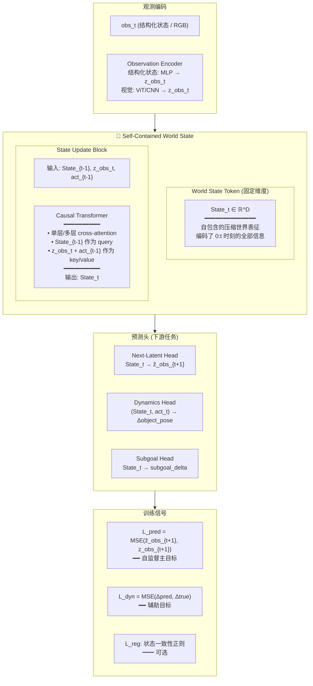

# SCWM — Self-Contained World Model 架构设计

> 工作名称: SCWM  
> 日期: 2026-05-20 | 作者: brucewu + Paper1  
> 定位: Paper2 基座世界模型，以 C-JEPA 为基线，对比 OOD 效果  
> 核心哲学: **LLM-like — 自包含状态信息的表征、架构和目标**

---

## 0. 核心哲学

### 不是什么

- ❌ **不是 Action-Centric**：动作不是模型的中心，只是状态转移的一个输入条件
- ❌ **不是 Object-Centric**：物体结构是 tokenization 层面的工程选择，不是哲学层面的"中心"
- ❌ **不是 Prediction-Centric**：预测是训练信号，不是模型的本质

### 是什么

- ✅ **Representation-Centric（表征为中心）**：模型的本质是一个**自包含的、可随时间更新的、压缩的世界状态表征**
- ✅ **LLM 类比**：就像 GPT 的 hidden state 在位置 i 编码了前 i 个 token 的全部信息，SCWM 的 world state 在时间 t 编码了前 t 个时刻的全部世界信息
- ✅ **自包含**：world state 不依赖外部存储、不依赖完整历史回放，仅凭当前 state + 新观测即可更新

### 一句话

> 我们要的不是"会预测动作的模型"，也不是"会分解物体的模型"。我们要的是：**一个维护压缩世界状态的 Transformer，它的 hidden state 本身就是我们对世界的全部理解。**

---

## 1. 与 C-JEPA 的本质区别

这是理解 SCWM 设计最关键的部分：

```
C-JEPA:
  每一轮预测都是 "从零开始"
  context(t-k:t) → context_encoder → predictor → target_encoder(target_frame) 的 latent
  没有持久状态 —— context_encoder 的输出只服务于这一次预测

SCWM:
  维护一个持久的世界状态
  State_t = Update(State_{t-1}, obs_t, act_{t-1})
  State_t 是跨时间的累积压缩，不是单次计算的临时产物
```

| 维度 | C-JEPA | SCWM (本设计) |
|------|--------|--------------|
| **持久状态** | 无（每次从 context 重新编码） | 有（State_t 随时间演化） |
| **信息累积** | context window 决定信息量 | State 压缩了完整历史 |
| **长程依赖** | 受限于 context window 大小 | State 可以跨越任意长的时间 |
| **表征哲学** | context→target 的桥梁 | 对世界的自包含理解 |
| **LLM 类比** | BERT（双向，无状态） | GPT（自回归，有状态） |
| **训练目标** | JEPA: context→target latent 预测 | AR: State_t → State_{t+1} 预测 |

---

## 2. 总体架构



---

## 3. 核心模块: Self-Contained World State Token

### 3.1 为什么需要这个 Token

在 C-JEPA 中，context encoder 的输出是一个 batch 内的临时产物，用完即弃。这导致：

- 长程依赖需要超长 context window（计算昂贵）
- 信息不能跨 episode 累积
- 无法做增量推理（每次都要重新编码整个 context）

SCWM 的 State Token 解决这些问题：

```text
State_t 的性质:
  1. 固定维度 D（如 256 或 512）
  2. 只依赖于 State_{t-1} + 当前输入（obs_t, act_{t-1}）
  3. 编码了 0:t 时刻的完整世界信息
  4. 可以像 LLM 的 KV-cache 一样被缓存和复用
```

### 3.2 更新机制

```text
State_t = TransformerUpdate(
    query = State_{t-1},          # 对世界的当前理解
    key   = [z_obs_t, act_{t-1}], # 新观测 + 上一步动作
    value = [z_obs_t, act_{t-1}]
)

# 展开:
# State_{t-1} "询问": 新观测中有什么是我不知道的？有什么改变了？
# z_obs_t "回答": 物体移动了、新物体出现了、goal 更近了...
# State_t "整合": 更新我对世界的全部理解
```

### 3.3 与 LLM 的精确类比

```text
LLM:
  hidden_t = Transformer(token_t, hidden_{t-1})
  hidden_t 编码了 token_0 ... token_t 的全部语义信息
  
SCWM:
  State_t = Transformer((z_obs_t, act_{t-1}), State_{t-1})
  State_t 编码了 时刻_0 ... 时刻_t 的全部物理世界信息
```

---

## 4. 训练范式

### 4.1 主目标: Next-Latent-State Prediction

这是核心创新。就像 LLM 的 next-token prediction 驱动了全部能力，SCWM 的 next-latent-state prediction 驱动世界理解：

```text
给定: (obs_0, act_0, obs_1, act_1, ..., obs_t, act_t)
任务: 预测 obs_{t+1} 的 latent 表征

流程:
  State_0 = InitState()
  for i in 0..t:
      State_{i+1} = Update(State_i, obs_i, act_i)
  ẑ_obs_{t+1} = NextLatentHead(State_{t+1})
  
  Loss = MSE(ẑ_obs_{t+1}, Encoder(obs_{t+1}))
```

### 4.2 Teacher Forcing 训练

训练时使用 teacher forcing（类似 LLM 训练时用真实前文）：

```python
# 给定完整轨迹
obs_seq = [obs_0, obs_1, ..., obs_T]
act_seq = [act_0, act_1, ..., act_{T-1}]

# 编码所有观测
z_obs_seq = encoder(obs_seq)  # [T+1, D_z]

# 初始化状态
state = init_state()  # [B, D]

total_loss = 0
for t in range(T):
    # 用真实观测更新状态
    state = update(state, z_obs_seq[t], act_seq[t])
    # 预测下一个 latent
    z_pred = next_latent_head(state)
    # 与真实 latent 比较
    loss = MSE(z_pred, z_obs_seq[t+1])
    total_loss += loss
```

### 4.3 辅助目标

```text
L_total = L_pred + λ_dyn * L_dyn + λ_subgoal * L_subgoal + λ_reg * L_reg

L_pred:    Next-latent prediction (自监督, 主目标)
L_dyn:     Dynamics prediction (监督, 对接 Paper1 的 rollout)
L_subgoal: Subgoal prediction (监督, 对接 Paper1 的 MPC)
L_reg:     状态一致性正则 (可选, 见 §9)
```

---

## 5. 长上下文方案

### 5.1 挑战

- 100 帧 × 256 tokens/帧 = 25,600 tokens → 全注意力 O(n²) 昂贵
- 但物理交互确实需要长上下文（遮挡、慢变化、长因果链）

### 5.2 方案: Sliding Window + Compressed State

```text
┌─────────────────────────────────────────────┐
│  完整历史                                    │
│  [obs_0, act_0, obs_1, act_1, ..., obs_99] │
└─────────────────────────────────────────────┘
                    ↓ 压缩
        ┌──────────────────────┐
        │  State_{t-window}    │  ← 压缩了 0:t-window 的全部信息
        │  (固定维度向量)       │
        └──────────────────────┘
                    +
        ┌──────────────────────┐
        │  最近 window 帧      │
        │  obs_{t-window:t}    │  ← 保留精细信息
        └──────────────────────┘
                    ↓
        ┌──────────────────────┐
        │  State_t             │  ← 融合: 压缩历史 + 精细近期
        └──────────────────────┘
```

实现方式：

```text
1. 短序列训练 (如 10 帧 window)
   - State_{t-10} 在训练时直接学习压缩
   
2. 长序列推理 (如 100 帧 rollout)
   - 每 10 帧将 State 作为下一 window 的初始状态
   - 类似 Transformer-XL 的 segment-level recurrence
   
3. 关键: State 的维度远小于 window 内所有帧的总维度
   压缩比: window_size * D_z / D_state
   例如: 10 * 128 / 256 = 5x 压缩
```

### 5.3 与 LLM 长上下文技术的对应

| LLM 技术 | SCWM 对应 |
|----------|----------|
| RoPE 位置编码 | 时间步编码 (帧索引) |
| Flash Attention | 高效注意力实现 |
| KV Cache | State_t 本身就是压缩的 KV |
| Sliding Window | 近期帧全注意力 + 远期压缩为 State |
| Transformer-XL | State 跨 segment 传递 |
| Ring Attention | 分布式长序列 (多 GPU 时) |
| YaRN (Context Extension) | 短 window 训练 → 长 window 推理 |

---

## 6. 观测编码器

### 6.1 两种输入模态

```text
Paper 1 模式 (结构化状态):
  obs_t = [6 tokens × 16 dim]  →  MLP →  z_obs_t ∈ ℝ^128
  
Paper 2 模式 (视觉):
  obs_t = RGB image  →  ViT/CNN  →  patch embeddings  
         →  Slot Attention  →  z_obs_t = [N_slots × D_slot]
```

### 6.2 设计原则

- 编码器是**可替换的模块**，不影响 SCWM 的核心架构
- Paper 1 用结构化状态验证架构有效性
- Paper 2 换视觉编码器，对比 C-JEPA 的视觉表征质量

---

## 7. 与 Paper1 的对接

```text
Paper 1: 三种 encoder 对比 (Flat / Object-Centric / Causal-Aware)
         + 固定 CEM-MPC planner
         → 证明: 结构化表征提高 OOD 泛化

Paper 2: SCWM (自包含世界状态)
         vs C-JEPA (context→target)
         + 相同 planner
         → 证明: 持久压缩状态 > 无状态 context 编码
```

### 7.1 对接点

```text
SCWM.State_t  →  DynamicsHead  →  Δobject_pose  
              →  SubgoalHead   →  subgoal_delta
              →  喂给 Paper1 的 CEM-MPC (rollout_model.py)

# 所以 SCWM 的 State_t 等价于 Paper1 的 z (planner-facing representation)
# 但 State_t 有额外的性质: 持久、可累积、长程
```

---

## 8. 与 ACWM (昨日设计) 的关系

ACWM 是昨日写的 Action-Centric 设计。SCWM 是今天基于你的核心观点修正后的设计。

| 维度 | ACWM (昨日) | SCWM (今日) |
|------|-----------|-----------|
| **中心** | Action (输出动作序列) | State (维护世界表征) |
| **输出** | 动作序列 + STOP token | 状态表征 → 多个下游预测头 |
| **闭环** | 动作→执行→感知→再动作 | 状态更新 → 预测 → (可选)动作 |
| **自适应步数** | 核心机制 | 下游能力 (通过 subgoal head) |
| **与 LLM 类比** | 隐式 | 显式(State = hidden, Next-Latent = Next-Token) |
| **训练主目标** | 动作预测 | Next-latent-state 预测 |

**SCWM 继承 ACWM 的部分:**
- Transformer 骨干 ✅
- Causal attention ✅  
- Object-centric token 结构 (编码器层) ✅

**SCWM 改变的部分:**
- 核心从"动作生成"变为"状态维护" 🔄
- 主训练目标从 action loss 变为 next-latent loss 🔄
- 显式建模持久状态 token 🔄

---

## 9. 核心创新点 (论文贡献)

### 主创新: Self-Contained World State

> 我们提出: 世界模型的核心应该是一个**自包含的、持久的世界状态表征**，而非每次从原始上下文重新计算的临时编码。

### 支撑论据

1. **理论**: LLM 的成功表明，压缩的、持久的、可自回归更新的 hidden state 是强大的表征形式
2. **架构**: Causal Transformer 天然支持这种设计
3. **训练**: Next-latent-state prediction 是自然的自监督信号
4. **OOD**: 持久状态可以在训练分布外维持一致的物理理解，因为它依赖的是"更新规则"而非"记忆特定分布的模式"

---

## 9b. 核心论点: 特定任务训练 → 泛化能力涌现

### 这是一个关键的论文论点

> 类比 LLM: GPT 只在 next-token prediction 上训练（一个特定任务），但涌现了翻译、推理、代码生成等泛化能力。为什么？因为 next-token prediction **迫使模型压缩世界知识到 hidden state 中**。
>
> SCWM 的核心假说: **next-latent-state prediction 同样会迫使模型压缩物理世界知识到 State_t 中**。任务特定的 dynamics/subgoal head 只是辅助——真正的泛化能力来自 State_t 本身的质量。

### 泛化的三个层次

```text
Level 1: 场景 OOD (Layout / Shape / Obstacle)
  训练: open-space, T-shape objects
  测试: narrow-passage, L-shape objects
  → State_t 的 update function 学会的是物理规则，不依赖特定场景配置

Level 2: 任务内 OOD (未见过的物体组合)
  训练: 推 T-shape, 3 障碍物
  测试: 推 L-shape, 5 障碍物
  → Object-centric token 结构支持组合泛化

Level 3: 跨任务涌现 (前瞻)
  训练: push-to-pose
  期望涌现: State_t 可用于 pick-and-place, 碰撞预测, 可达性判断
  → 类似 LLM 的 zero-shot transfer
```

### 为什么 next-latent prediction 驱动泛化

```text
监督学习 (action prediction):
  模型学会: "这个场景配置 → 这些动作"
  泛化来源: 训练覆盖的场景分布
  问题: 分布外场景 → 动作可能完全错误

Next-latent prediction (自监督):
  模型学会: "任何场景 → 物理演化后的下一个状态"
  泛化来源: 物理规则本身（质量、摩擦、接触力学在所有场景中相同）
  优势: 只要 observation encoder 能编码新场景，update function 就能预测演化
```

### 关键实验: 证明泛化来自 State 而非 Action Head

```text
实验设计:
  1. 在 ID 场景上训练 SCWM
  2. 冻结 State Update + Encoder
  3. 仅在 OOD 场景的少量数据上微调 Dynamics Head / Subgoal Head
  
预测:
  如果 State_t 确实学到了泛化的物理表征，
  那么 OOD 场景只需要很少的 head 微调就能恢复性能，
  因为 State_t 已经在 ID 训练中学会了通用的物理理解。
  
对比:
  如果从头训练 (无预训练 State)，OOD 场景需要大量数据。
  → 差异 = State 预训练带来的泛化增益
```

### 这回答了 "LLM 技术如何复用到 WM"

| LLM 现象 | WM 对应 |
|----------|---------|
| 预训练 → few-shot learning | ID 训练 → OOD head 快速适应 |
| 语言理解来自 next-token | 物理理解来自 next-latent |
| Scaling law | 更多场景 → 更好的 State 表征 |
| Emergent abilities | State_t 的跨任务 zero-shot |
| Instruction tuning | 目标条件: State_t + goal → subgoal |

### 消融实验设计

| 消融 | 对应假设 |
|------|---------|
| – 持久 State (改为每次从 context 重新编码) | 持久状态 > 无状态编码 |
| – Next-latent loss (改为纯监督 loss) | 自监督预测 > 纯监督 |
| – State 更新 (改为 concat + MLP) | Transformer 更新 > 简单融合 |
| – 长 window (限制为短 window) | 长上下文 > 短上下文 |
| – Object token 结构 (改为 flat vector) | 结构化编码有帮助但不是核心 |

---

## 10. 最小可行实现 (MVP)

### Phase 1: 结构化状态验证 (Paper 1 环境)

```text
输入: structured state (6 tokens × 16 dim)
      6 帧历史
      
模块:
  - MLP Encoder: [6, 16] → [128]
  - SCWS Core: L=2 层 causal Transformer
    - State dim: 256
    - 输入: [State_{t-1}, z_obs_t, act_{t-1}] 拼接
  - Next-Latent Head: 256 → 128
  - Dynamics Head: 256 → 3
  - Subgoal Head: 256 → 3

训练:
  - L_pred (next-latent) 自监督
  - L_dyn + L_subgoal 监督

对比基线:
  - C-JEPA 风格: context encoder → predictor → target encoder (不维护 state)
  - Paper1 三类 encoder: Flat / Object-Centric / Causal-Aware
```

### Phase 2: 视觉世界模型 (Paper 2 环境)

```text
替换:
  - MLP Encoder → ViT + Slot Attention
  
其余架构不变。对比 C-JEPA 的视觉版本。
```

---

## 11. 开放问题 (需要讨论)

1. **State 维度**: 256? 512? 需要实验确定
2. **State 初始化**: 零向量? 可学习参数? 第一帧编码?
3. **是否需要多个 State tokens**: 一个全局 state vs 每个 object 一个 state token
4. **L_reg 的具体形式**: 
   - Option A: 要求 State_t 可以重建历史观测 (autoencoder-style)
   - Option B: 要求 State_t 的更新幅度有上界 (smoothness)
   - Option C: InfoNCE contrastive: State_t 应该与相关未来帧相似
5. **与 C-JEPA 的公平比较**: 
   - 参数量对齐?
   - Context window 对齐?
   - 还是各取最优配置?

---

## 12. 下一步

- [ ] brucewu 确认架构方向
- [ ] 确定 MVP 的具体参数
- [ ] 实现 Phase 1: structured-state SCWM
- [ ] 训练 + 对比 Paper1 三类 encoder
- [ ] 实现 C-JEPA baseline (同环境)
- [ ] OOD 对比: SCWM vs C-JEPA
- [ ] Phase 2: 视觉 SCWM

---

*Last updated: 2026-05-20 | 基于 brucewu 的核心观点重新设计*
