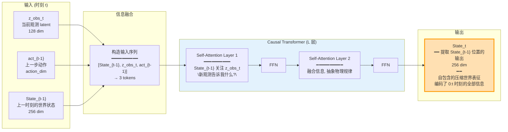
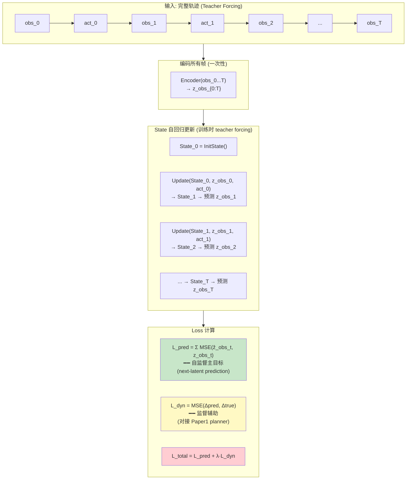
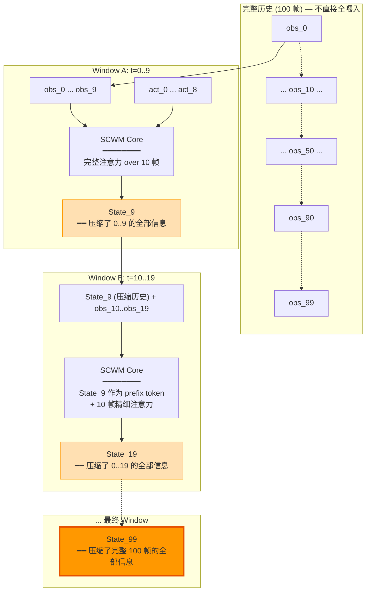
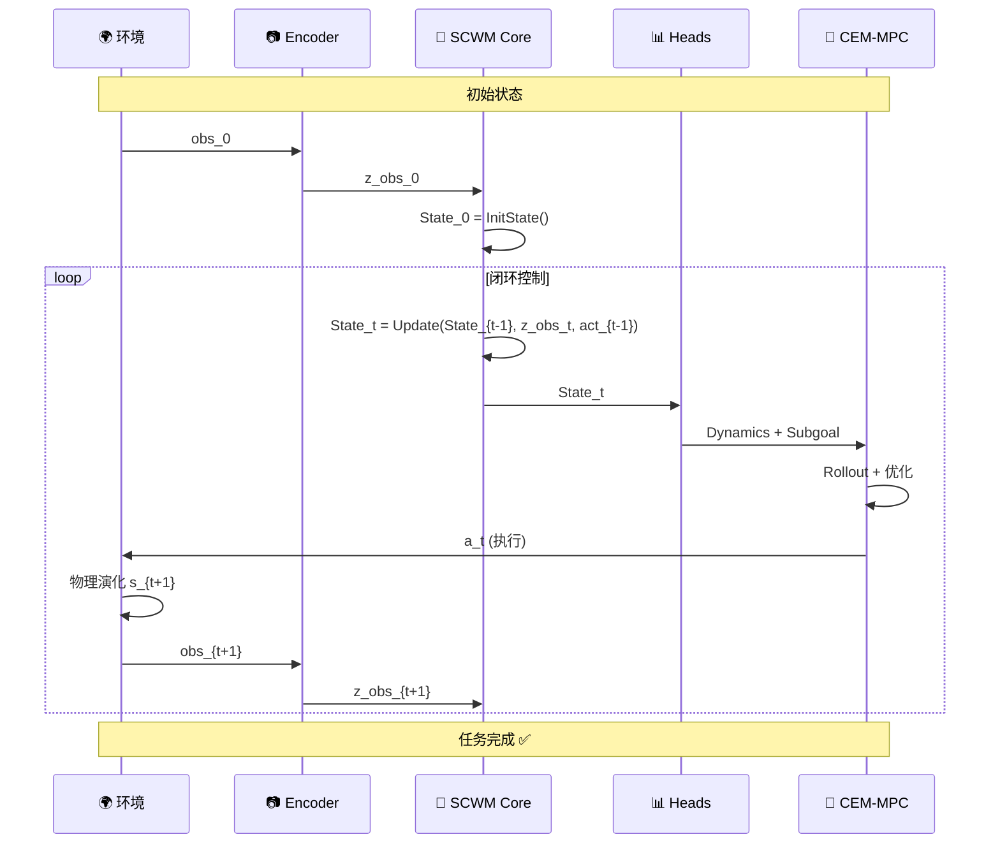
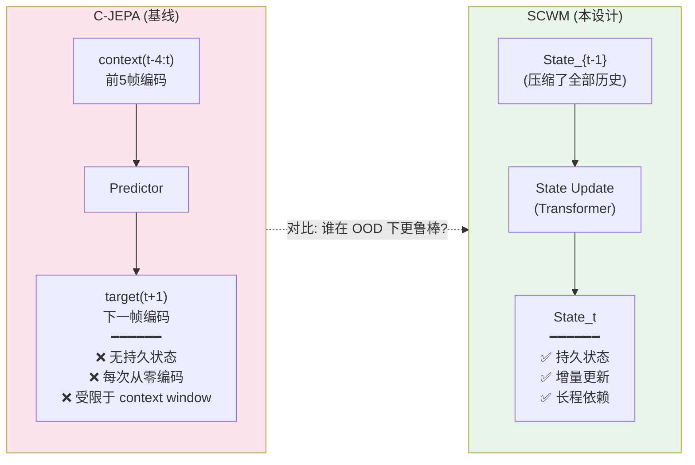
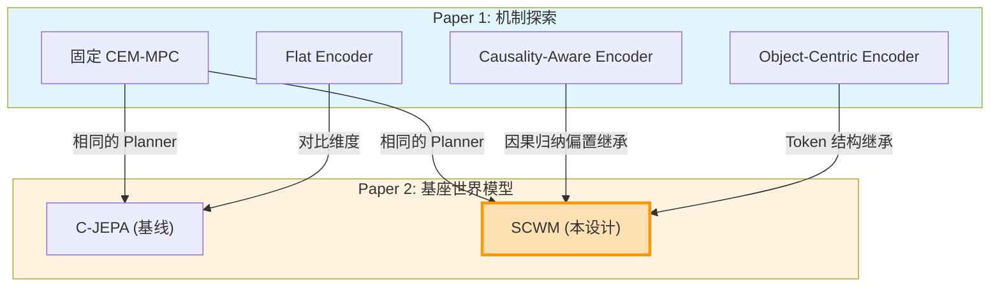

# SCWM 架构图

> 清晰版 | 2026-05-20

---

## 一、总览: 闭环架构

```mermaid
flowchart TB
    subgraph WORLD["🌍 物理世界"]
        PHYS["真实/仿真环境<br/>s_{t+1} = T(s_t, a_t)"]
    end

    subgraph PERCEPTION["📷 感知编码"]
        RAW["obs_t<br/>(结构化状态 / RGB)"]
        ENC["Observation Encoder<br/>结构化: MLP | 视觉: ViT+Slot"]
        Z_OBS["z_obs_t ∈ ℝ^128"]
    end

    subgraph CORE["🧠 SCWM 核心: Self-Contained World State"]
        direction TB
        
        S_PREV["State_{t-1} ∈ ℝ^256<br/>(来自上一时刻)"]
        
        subgraph UPDATE_BLOCK["State Update (Causal Transformer)"]
            QUERY["Query: State_{t-1}<br/>\"我对世界的当前理解\""]
            KV["Key/Value: z_obs_t + act_{t-1}<br/>\"新观测 + 上一步动作\""]
            CROSS["Cross-Attention<br/>━━━━━━━━━━<br/>State_{t-1} 查询新信息<br/>→ 更新为 State_t"]
        end
        
        S_NEW["State_t ∈ ℝ^256<br/>\"更新后的世界理解\"<br/>━━━━━━━━━━<br/>自包含 · 持久 · 可累积"]
    end

    subgraph HEADS["📊 预测头"]
        NL["Next-Latent Head<br/>State_t → ẑ_obs_{t+1}"]
        DYN["Dynamics Head<br/>(State_t, act_t) → Δpose"]
        SG["Subgoal Head<br/>State_t → subgoal"]
    end

    subgraph PLANNER["🎯 Planner (Paper1: CEM-MPC)"]
        ROLLOUT["rollout_model.py<br/>用 Dynamics Head 做前向模拟"]
        MPC["CEM-MPC 优化动作序列"]
        ACT["输出: a_t"]
    end

    WORLD --> RAW
    RAW --> ENC
    ENC --> Z_OBS
    Z_OBS --> KV
    S_PREV --> QUERY
    QUERY --> CROSS
    KV --> CROSS
    CROSS --> S_NEW
    
    S_NEW --> NL
    S_NEW --> DYN
    S_NEW --> SG
    
    DYN --> ROLLOUT
    SG --> MPC
    ROLLOUT --> MPC
    MPC --> ACT
    ACT --> WORLD

    style CORE fill:#fff3e0,stroke:#ff9800
    style S_NEW fill:#ffe0b2,stroke:#ff9800,stroke-width:3px
    style NL fill:#e8f5e9
    style DYN fill:#e8f5e9
    style SG fill:#e8f5e9
```

---

## 二、核心: State Update 机制 (展开)

这是整个架构最重要的一张图。



---

## 三、训练流程



---

## 四、长上下文: Sliding Window + State 压缩



---

## 五、推理闭环



---

## 六、对比: SCWM vs C-JEPA



---

## 七、与 Paper1 的继承关系



---

*架构图版本: v1.0 | 2026-05-20*
