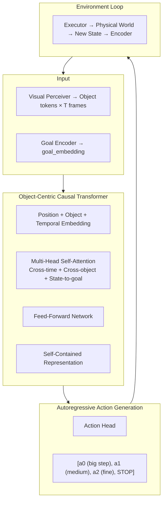
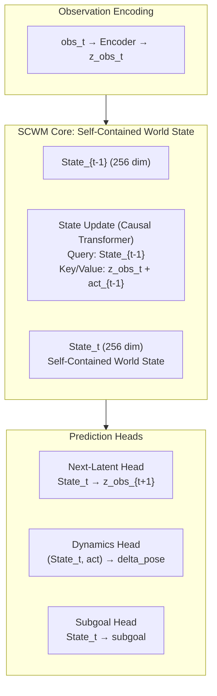
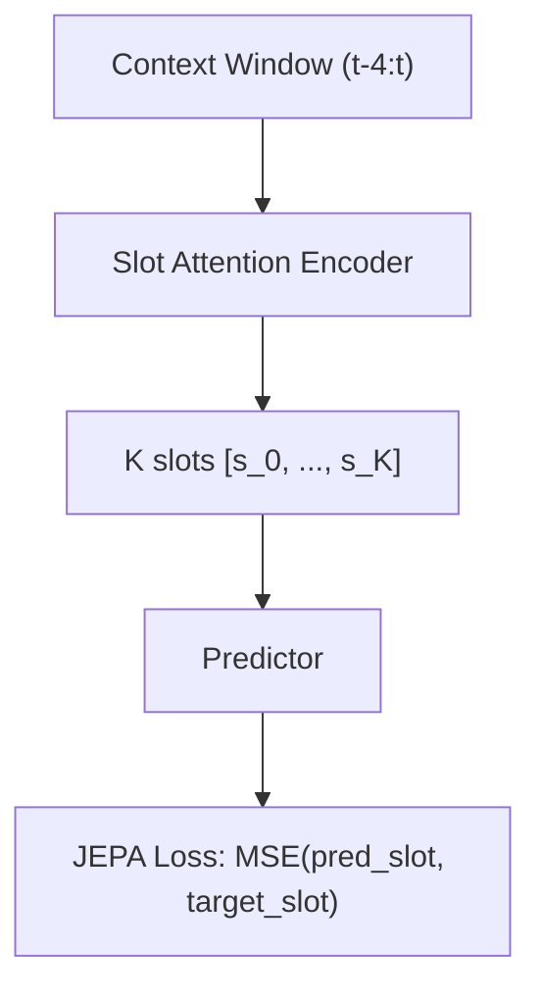
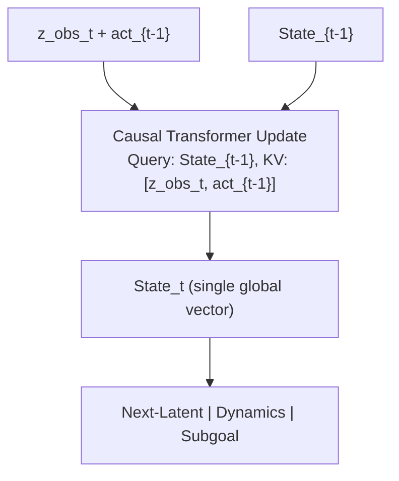
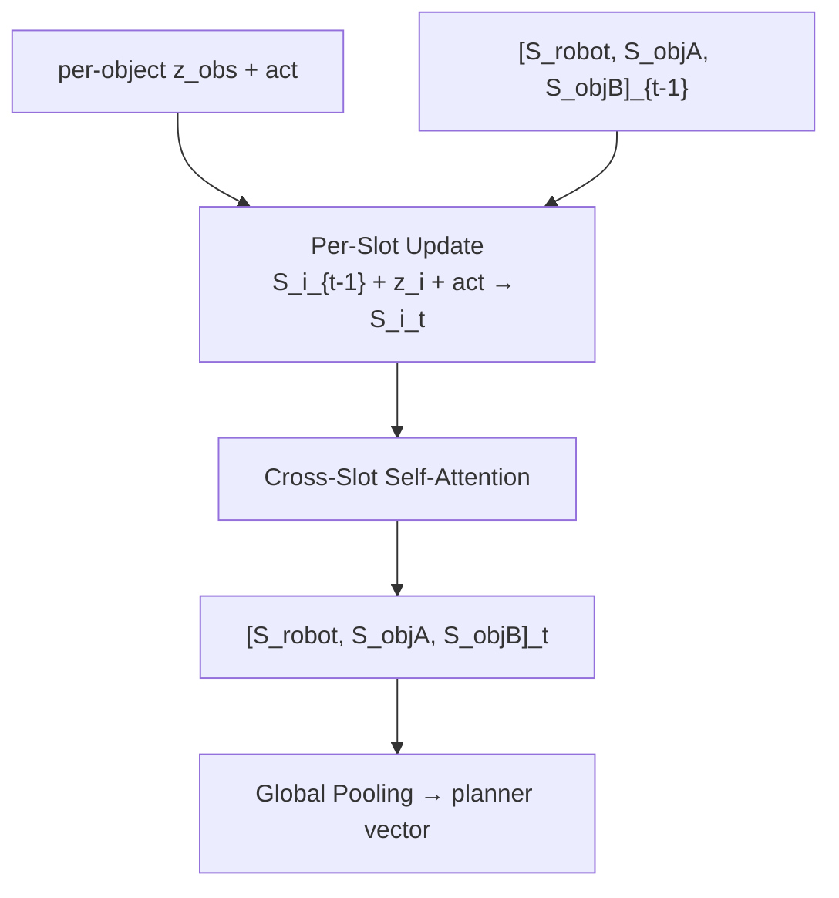
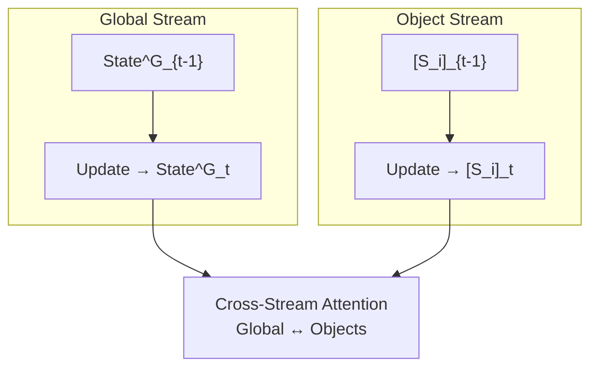
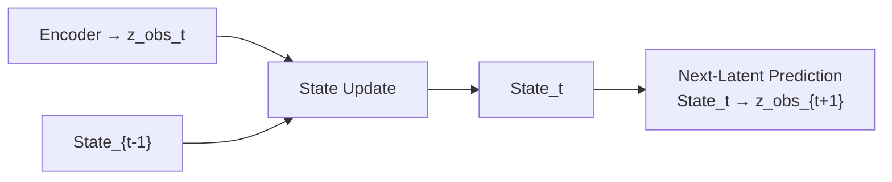
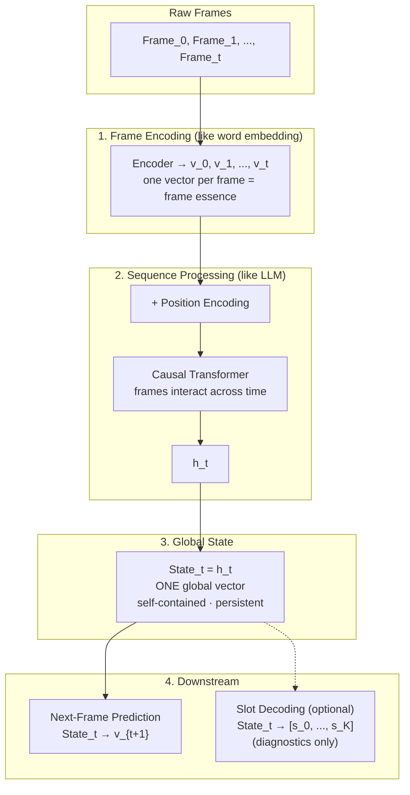
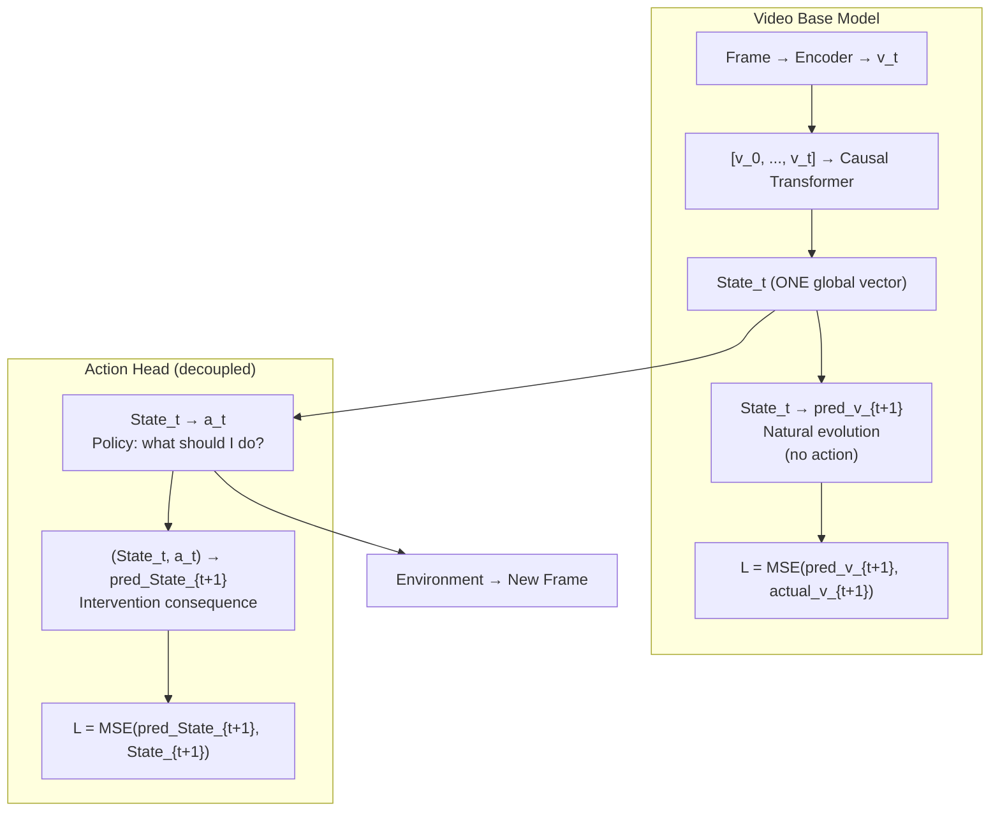
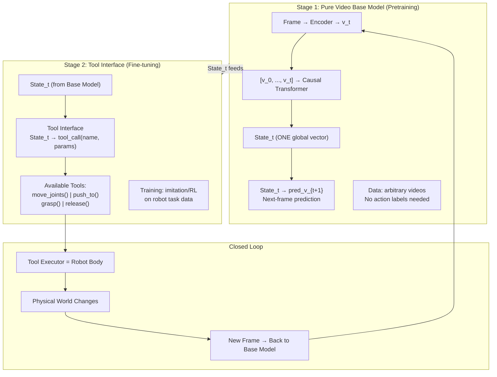

# World Model 架构演化全纪录

> 日期: 2026-05-19 ~ 2026-05-20  
> 作者: brucewu + Paper1  
> 目的: 记录所有架构版本及其演化逻辑，方便对比和选择

---

## 演化总览

```
ACWM (5/19)
  │  Action-Centric，统一输出动作序列
  │
  ▼ 用户反馈: 核心不是 action-centric，是自包含状态
SCWM v1 (5/20 早)
  │  持久 State_t + next-latent prediction
  │  但保留了 object token 结构、多个 head
  │
  ├──→ 四条路径展开: Global / Slots / Hybrid / C-JEPA
  │
  ▼ 用户反馈: 动作头可以完全移除，WM 只做状态
Simplified SCWM (5/20 中)
  │  去掉 action head，纯状态维护+next-latent prediction
  │
  ▼ 用户反馈: 每帧应该是一个向量，不是 object tokens
FTWM (5/20 中午)
  │  Frame-as-Token, one vector per frame = frame essence
  │
  ▼ 用户反馈: 动作是解耦的，base model + action head 两层
FTWM + Action Head (5/20 午)
  │  自然演化预测 + 干预后果预测，两层因果框架
  │
  ▼ 用户洞察: 动作不是动作，是 tool use!
Agentic FTWM (5/20 下午)
     Base Model + Tool Interface
     复刻 LLM pretrain → instruct → tool-use → agentic 路径
```

---

## Version 0: ACWM — Action-Centric World Model

**日期:** 2026-05-19  
**文件:** `design/ACWM_architecture.md`

### 核心思想

统一模型直接从世界理解输出动作序列。Object-Centric tokens → Transformer → 自回归动作生成 + STOP token。

### 架构图



### 关键特征

- Object-centric token 结构
- 输出变长动作序列 [a₀, a₁, a₂, STOP]
- 自适应步数机制
- Causal-aware attention 涌现因果结构

### 与 C-JEPA 的对比

| 维度 | C-JEPA | ACWM |
|------|--------|------|
| 任务目标 | 预测 latent 状态 | 输出动作 |
| 表征方式 | 全局 latent | Object-Centric tokens |
| 输出 | next latent state | action sequence + STOP |
| 哲学 | "先理解世界，再行动" | "理解和行动一体" |

### 为什么演化？

用户: "我的核心观点不是 action-centric 或者 object-centric。我们需要一个 LLM 类似的、自包含状态信息的表征、架构和目标。"

→ ACWM 的"动作中心"哲学与用户核心观点不一致

---

## Version 1: SCWM — Self-Contained World Model

**日期:** 2026-05-20 上午  
**文件:** `design/SCWM_architecture.md`

### 核心思想

从"动作中心"转向"状态中心"。核心是一个持久、自包含、可随时间更新的世界状态 token。

### 架构图



### 关键特征

- State_t = Update(State_{t-1}, z_obs_t, act_{t-1})
- 训练主目标: next-latent-state prediction
- 类比 LLM: State = hidden state, Next-Latent = Next-Token
- 长上下文: Sliding Window + Compressed State

### 与 C-JEPA 的本质区别

| | C-JEPA | SCWM |
|---|---|---|
| 持久状态 | 无（每次从 context 重新编码） | State_t 累积全历史 |
| 长程依赖 | 受限于 context window | State 跨任意长度 |
| LLM 类比 | BERT | GPT |

### 为什么演化？

1. Object token 结构是残留（用户要的是"不是 object-centric"）
2. 动作头仍然在核心架构里（用户后来明确要解耦）
3. 四个预测头让架构不够干净

---

## Version 2: 四条路径展开

**日期:** 2026-05-20 上午  
**文件:** `design/architecture_paths_comparison.md`

### 路径 A: C-JEPA (Baseline)

无持久状态。Slot Attention 竞争产生 object slots。Object-level masking 引入因果 inductive bias。每次从 context window 重新编码。



### 路径 B: SCWM-Global (Single State Token)

单一全局 State_t。最 LLM-like。物体结构仅在输入 tokenization 层。



### 路径 C: SCWM-Slots (Per-Object State Tokens)

每个物体维护自己持久状态。物体间通过 cross-slot attention 交互。



### 路径 D: SCWM-Hybrid (Global + Object Slots)

双流架构。Global State (128 dim) 捕获任务/物理参数。Object States (64 dim × K) 捕获物体动态。Cross-stream attention。



### 对比矩阵

| | Path A C-JEPA | Path B Global | Path C Slots | Path D Hybrid |
|---|---|---|---|---|
| 持久状态 | ❌ | ✅ 单向量 | ✅ 多向量 | ✅ 双流 |
| LLM 相似度 | 低 | ⭐⭐⭐ | ⭐⭐ | ⭐ |
| 组合泛化 | ⭐⭐ | ⭐ | ⭐⭐⭐ | ⭐⭐⭐ |
| 全局信息 | 涌现(弱) | 天然融合 | 需pooling | 显式 |
| 复杂度 | 中 | 最低 | 中 | 高 |

### 结论

Path B (SCWM-Global) 首推主攻，与 C-JEPA 对比最清晰。Path C/D 作为消融备选。

---

## Version 3: Simplified SCWM (去掉动作头)

**日期:** 2026-05-20 中午

### 核心思想

用户: "LLM 也存在动作，它的动作就是非常简单的将已经预测好的 token 加一个位置向量，然后挂到序列后面。"

→ 动作应该从 WM 中完全移除。WM 只做 next-latent prediction。



### 关键变化

- 去掉 Dynamics Head、Subgoal Head、Action Head
- 只保留 Next-Latent Prediction
- WM = 纯状态维护 + 预测
- Executor 独立: 读取 State_t 产生动作

---

## Version 4: FTWM — Frame-as-Token World Model

**日期:** 2026-05-20 中午

### 核心思想

用户: "一帧虽然是这么多 patch，但是只需要压缩成一个向量就好了，代表这一帧是什么，阐明该帧的本质内涵。然后像 LLM 一样，将这个帧的代表向量与其他帧交互。"

→ 每帧 = 一个 token。不是 K 个 slot。

### 架构图



### 关键特征

- Frame → v_t (one vector, frame essence)
- [v_0, ..., v_t] → Causal Transformer → State_t (ONE global vector)
- Slot 是下游解码，不是架构基础

### 与 C-JEPA 的本质差异

| | C-JEPA | FTWM |
|---|---|---|
| Frame encoding | Slot competition → K slots | One vector per frame |
| Representation | N slots (distributed) | ONE global State_t |
| Slots | 编码方式 (upstream) | 解码产物 (downstream) |

---

## Version 5: FTWM + Action Head (两层解耦)

**日期:** 2026-05-20 下午

### 核心思想

用户: "base model 也是下一个状态预测，但不需要引入动作。从现在的状态中解耦出机械臂的动作。动作的解耦头的训练也需要预测机械臂的后果。"

→ Base Model 预测自然演化，Action Head 预测干预后果。两层预测，因果解耦。

### 架构图



### 关键特征

- 两层预测的因果含义:
  ```
  State_t → pred_v_{t+1}       (自然演化)
  State_t → a_t → pred_State   (干预后果)
  差异 = 动作的因果效应
  ```
- Base Model 不需要动作标签
- Action Head 需要机器人操作数据

---

## Version 6: Agentic FTWM (最终版)

**日期:** 2026-05-20 下午

### 核心思想

用户: "我们需要的是一个 agentic 的世界模型！动作不是动作，动作是 tool 的能力。先做理解世界的世界模型，再做 agentic 世界模型，完全复刻 LLM 的内部规律。"

### 架构图



### 关键特征

复刻 LLM 的完整发展路径:

```
LLM Path:                      FTWM Path:
─────────                      ──────────
1. Pretrain on text            1. Pretrain on video
   (next-token prediction)        (next-frame prediction)
   → Language understanding       → World understanding

2. Instruction tuning           2. Tool-use fine-tuning
   → Follow instructions           → Use robot body

3. Tool use                     = 2 (same stage)
   → Search, code, browser        → Move, grasp, push

4. Agentic                      = 2+ (same stage)
   → Multi-step reasoning          → Multi-step task execution
```

### 与 Version 5 的关键区别

| | V5: FTWM + Action Head | V6: Agentic FTWM |
|---|---|---|
| 动作本质 | 连续向量输出 (a_t) | 离散 tool call (name, params) |
| 动作来源 | 模型内部生成 | 环境 tool executor |
| 后果预测 | Action Head 预测 | 环境真实反馈 |
| 跨 embodiment | 需重新训练 action head | 只换 tool 定义 |
| LLM 对齐 | 部分 | 完全 |

---

## 版本对比总表

| 版本 | 日期 | 核心思想 | State 结构 | 动作处理 | Slot | 状态 |
|---|---|---|---|---|---|---|
| **V0 ACWM** | 5/19 | Action-Centric | Object tokens | 模型输出序列 | 隐式 | 🔄 并行探索 |
| **V1 SCWM** | 5/20 早 | State-Centric | 全局向量 | 在 head 里 | 输入层 | ❌ 已演化 |
| **V2 四路径** | 5/20 早 | 展开设计空间 | Global/Slots/Hybrid | 在 head 里 | 三种方案 | 📋 备选 |
| **V3 Simplified** | 5/20 中 | 纯状态维护 | 全局向量 | 完全移除 | 无 | ❌ 已演化 |
| **V4 FTWM** | 5/20 中 | Frame-as-Token | 全局向量 | 无 | 下游解码 | ❌ 已演化 |
| **V5 +ActionHead** | 5/20 午 | 两层解耦 | 全局向量 | 解耦 head | 下游解码 | 🔄 保留 |
| **V6 Agentic** | 5/20 午 | Tool Use 范式 | 全局向量 | Tool Interface | 下游解码 | ✅ 主攻 |

---

## 演化驱动力

每次演化的触发点:

```
V0 → V1: "核心不是 action-centric，是自包含状态"
V1 → V2: "几种路径都设计一下，关键方向选择要谨慎"
V1 → V3: "LLM 的动作就是预测+追加，WM 也应该这样"
V3 → V4: "每帧一个向量，不需要 object tokens"
V4 → V5: "动作解耦，base model 不引入动作"
V5 → V6: "动作不是动作，是 tool！复刻 LLM agent 路径"
```

---

---

## 补充: Action Lift — 动作与状态的语义空间统一

**日期:** 2026-05-20 晚  
**触发:** 用户指出动作必须与状态处于同一语义空间

### 核心思想

动作有两个形态:

```
1. 向下解耦 (执行层):
   State_t → a_t (低维, 6d, 机器人执行命令)

2. 向上升维 (语义层):
   (a_t, env_context, 历史动作, 历史状态)
        ↓ Action Lift
   A_t (256d, 与 State_t 同一语义空间)
```

A_t 可以:
- 与 State_t 做 attention
- 直接相加/拼接
- 参与 world model 的语义推理
- 用于 counterfactual prediction

这与 LLM 的 token embedding 完全同构:
```
LLM:  discrete token → Embedding → continuous hidden space
AWM:  low-dim action → ActionLift → semantic space (与 State_t 同空间)
```

### 为什么重要

1. 自然演化预测和干预预测的差异在同一语义空间中有语义含义
2. 动作不再是一个"外部信号"，而是被提升为世界模型可以理解的"语义变量"
3. 这补上了 Tool Interface 架构的最后一个洞: 动作如何参与世界理解

---

*全纪录完成 | 2026-05-20*
