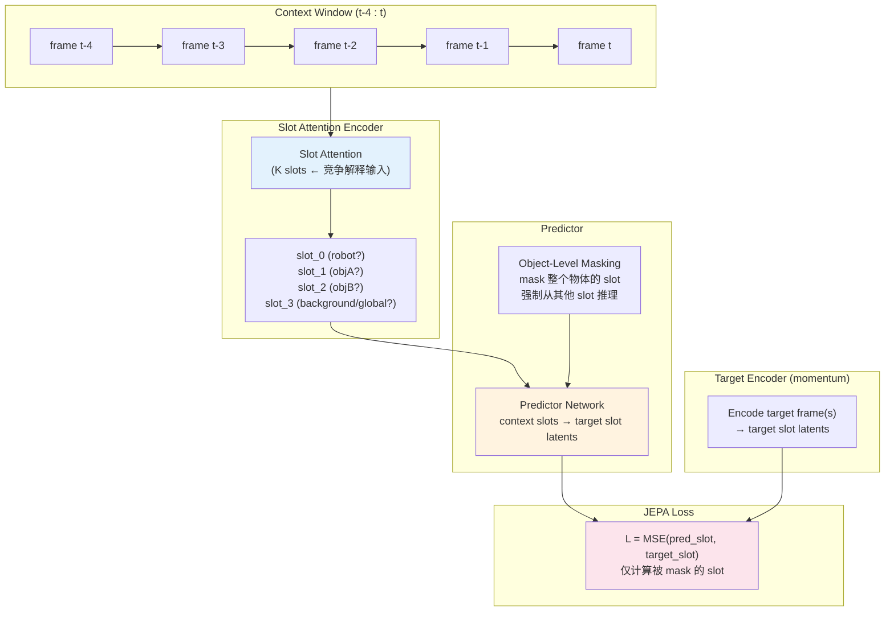
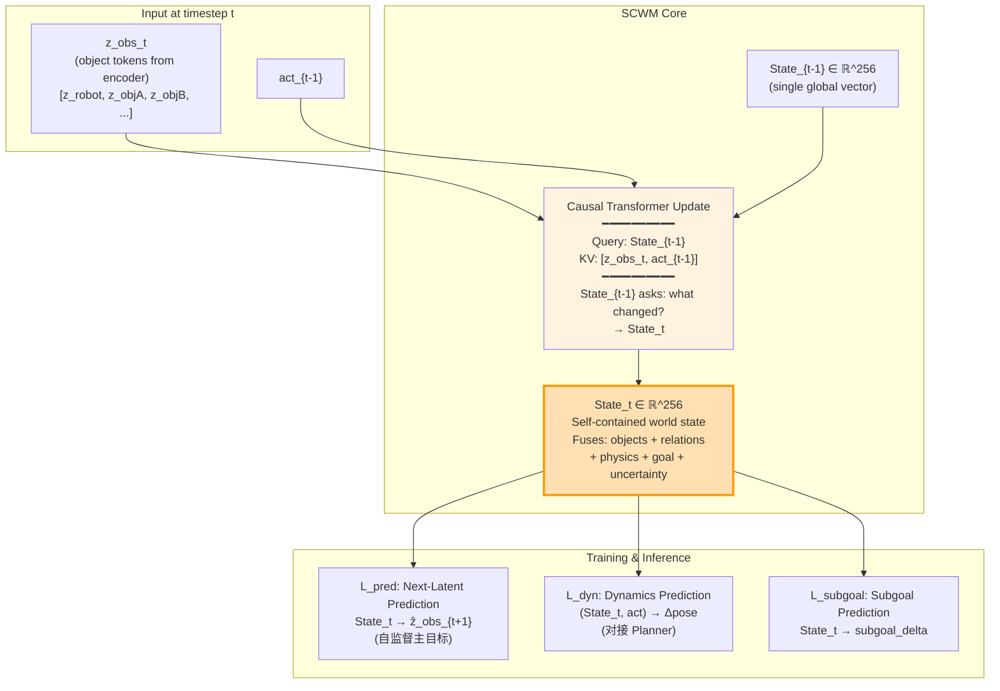

# World Model 架构路径对比

> 2026-05-20 | 关键方向选择  
> 目标: 在 C-JEPA baseline 之上，探索最优的持久状态世界模型架构

---

## 设计空间

两个核心维度正交组合：

```
维度 1: 是否有持久状态?
  ├── 无状态: 每次从 context window 重新编码 (C-JEPA 类)
  └── 有状态: 维护一个随时间演化的压缩世界表征 (SCWM 类)

维度 2: 状态的结构?
  ├── 单一全局: 一个向量编码一切
  ├── 分物体: 每个物体一个 state token
  └── 混合: 全局 state + 物体 slots
```

---

## 四条路径总览

```
                         状态结构 →
                单一全局      分物体        混合(全局+物体)
状态 ┌──────────┬──────────┬──────────┬──────────┐
持久 │ 无状态    │  N/A     │ Path A   │   N/A    │
     │          │          │ C-JEPA   │          │
     ├──────────┼──────────┼──────────┼──────────┤
     │ 有状态    │ Path B   │ Path C   │ Path D   │
     │          │SCWM-Global│SCWM-Slots│SCWM-Hybrid│
     └──────────┴──────────┴──────────┴──────────┘
```

---

## Path A: C-JEPA (Baseline)

**哲学**: 无持久状态，每次从 context 重新编码。槽通过竞争学习物体表征，全局理解"涌现"。



**关键特征:**
- K 个 slot，通过匈牙利匹配保持时序一致性
- Object-level masking 引入因果 inductive bias
- 全局信息（goal, 物理参数）没有专门表征——或分配给某个 slot，或丢失
- 每次推理从零编码 context window

**弱点 (SCWM 要攻击的):**
- 长程依赖受限于 context window 大小
- 全局状态表征不可靠
- 推理时需要完整 context window（计算量随 window 增长）
- 无增量更新能力

---

## Path B: SCWM-Global (Single State Token)

**哲学**: 单一全局 State_t 压缩全部世界信息。最 LLM-like 的设计。



**关键特征:**
- 一个 State_t 向量编码一切
- 物体结构仅在**输入 tokenization** 层保留（不是 state 层）
- State update 通过 cross-attention: State_{t-1} 查询新观测
- 训练主目标: next-latent prediction

**优势:**
- 最 LLM-like，哲学最清晰
- 简单，参数少
- 全局和物体信息自然融合，不需要显式分配

**风险:**
- 单一向量能否同时编码多个物体的独立状态？
- OOD 物体数量增加时，256 维可能不够 → 需要实验验证
- 物体 identity 可能在压缩中丢失

---

## Path C: SCWM-Slots (Per-Object State Tokens)

**哲学**: 每个物体维护自己的持久状态。物体间通过 attention 交互。接近 C-JEPA 的结构但有持久状态。

```mermaid
flowchart TB
    subgraph INPUT_C["Input at t"]
        OBS_C["z_obs_t = [z_robot, z_objA, z_objB]"]
        ACT_C["act_{t-1}"]
    end

    subgraph STATE_C["Persistent Object States"]
        direction LR
        S_Rt1["S_robot_{t-1}"]
        S_At1["S_objA_{t-1}"]
        S_Bt1["S_objB_{t-1}"]
    end

    subgraph UPDATE_C["Slot-Level State Update"]
        direction TB
        FUSE_C["Per-Slot Update<br/>S_i_{t-1} + z_i_t + act → S_i_t"]
        INTERACT["Cross-Slot Self-Attention<br/>━━━━━━━━━━<br/>objA attends to objB<br/>\"B 在靠近我吗？\"<br/>robot attends to all<br/>\"我该推哪个？\""]
        S_T_C["Updated States:<br/>S_robot_t, S_objA_t, S_objB_t"]
    end

    subgraph HEADS_C["Prediction"]
        NL_C["Per-Slot Next-Latent<br/>S_i_t → ẑ_i_{t+1}"]
        GLOBAL_C["Global Pooling<br/>→ Global State (for planner heads)"]
    end

    OBS_C --> FUSE_C
    ACT_C --> FUSE_C
    STATE_C --> FUSE_C
    FUSE_C --> INTERACT
    INTERACT --> S_T_C
    S_T_C --> NL_C
    S_T_C --> GLOBAL_C

    style INTERACT fill:#e3f2fd
    style S_T_C fill:#ffe0b2,stroke:#ff9800
```

**关键特征:**
- 每个物体有独立的 state token（维度假定为 64-128/物体）
- 每个物体的 state 独立更新，再通过 cross-slot attention 交互
- 需要 global pooling 产生 planner-facing 的固定维度向量
- 物体数量可变 → 天然支持组合泛化

**优势:**
- 物体 identity 清晰保留
- 组合泛化: 3物体→5物体，只需增加 slot，架构不变
- 每个 slot 可以独立诊断

**风险:**
- 不像 LLM（LLM 不按"主语/谓语"分 hidden state）
- 复杂度更高（多个 state, 多次 attention）
- Global pooling 可能丢失信息
- 训练时物体数量固定，推理时 OOD 物体数量 → 需要 slot 复制/丢弃策略

---

## Path D: SCWM-Hybrid (Global State + Object Slots)

**哲学**: 全局 state 捕获任务级信息 + 物体 slots 捕获物体级信息。双流交互。

```mermaid
flowchart TB
    subgraph INPUT_D["Input at t"]
        OBS_D["z_obs_t = [z_robot, z_objA, z_objB]"]
        ACT_D["act_{t-1}"]
        GOAL_D["goal_embedding"]
    end

    subgraph TWO_STREAMS["Dual-Stream Architecture"]
        subgraph GLOBAL_STREAM["Global Stream"]
            G_PREV["State_{t-1}^G ∈ ℝ^128<br/>Global: task, physics, context"]
            G_UPDATE["Update<br/>State_{t-1}^G + pooled obs → State_t^G"]
        end
        
        subgraph OBJECT_STREAM["Object Stream"]
            O_PREV["[S_robot, S_objA, S_objB]_{t-1}<br/>Per-object: dynamics, pose"]
            O_UPDATE["Update<br/>S_i_{t-1} + z_i + act → S_i_t"]
        end
        
        INTERACT_D["Cross-Stream Attention<br/>━━━━━━━━━━<br/>Global ↔ Objects<br/>\"Goal says go left,<br/> but objA is blocking\"<br/>\"ObjB is moving,<br/> update global physics belief\""]
    end

    subgraph OUTPUT_D["Output"]
        FUSED["Fused State<br/>State_t^G + pooled obj states<br/>→ planner-facing vector"]
    end

    GOAL_D --> G_UPDATE
    OBS_D --> G_UPDATE
    OBS_D --> O_UPDATE
    ACT_D --> G_UPDATE
    ACT_D --> O_UPDATE
    G_PREV --> G_UPDATE
    O_PREV --> O_UPDATE
    G_UPDATE --> INTERACT_D
    O_UPDATE --> INTERACT_D
    INTERACT_D --> FUSED

    style GLOBAL_STREAM fill:#e8f5e9
    style OBJECT_STREAM fill:#e3f2fd
    style INTERACT_D fill:#fff3e0
```

**关键特征:**
- Global State (128 dim): 任务目标, 物理参数, 全局上下文
- Object States (64 dim×K): 每个物体的动态
- 双流通过 cross-attention 交互
- Goal 显式注入 global stream

**优势:**
- 最结构化，信息分工明确
- Global state 直接解决 C-JEPA 的全局信息问题
- Object states 提供组合泛化
- 可解释性好（可以分别诊断 global vs object）

**风险:**
- **最复杂**，训练和调参成本高
- 可能 over-engineered——简单方案可能就够
- 两条流的协调可能不稳定
- 离 LLM 类比最远

---

## 四路径对比矩阵

| 维度 | Path A<br/>C-JEPA | Path B<br/>SCWM-Global | Path C<br/>SCWM-Slots | Path D<br/>SCWM-Hybrid |
|------|-------------------|----------------------|---------------------|---------------------|
| **持久状态** | ❌ | ✅ 单向量 | ✅ 多向量 | ✅ 双流 |
| **LLM 相似度** | 低 (BERT) | ⭐⭐⭐ 最高 (GPT) | ⭐⭐ 中 | ⭐ 低 |
| **组合泛化** | ⭐⭐ (slot 竞争) | ⭐ (需实验验证) | ⭐⭐⭐ | ⭐⭐⭐ |
| **全局信息** | ⭐ (涌现) | ⭐⭐⭐ (天然融合) | ⭐⭐ (需 pooling) | ⭐⭐⭐ (显式建模) |
| **复杂度** | ⭐⭐⭐ 低 | ⭐⭐⭐ 最低 | ⭐⭐ 中 | ⭐ 高 |
| **论文叙事** | Baseline | 最清晰的对比 | 折中方案 | 可能过度设计 |
| **物体 Identity** | ⭐⭐ (匈牙利匹配) | ⭐ (压缩中可能丢失) | ⭐⭐⭐ | ⭐⭐⭐ |
| **长上下文** | ❌ window 限制 | ✅ State 压缩 | ✅ Per-slot 压缩 | ✅ 双流压缩 |
| **OOD 物体数量** | ⭐⭐ | ⭐ (dim 瓶顼) | ⭐⭐⭐ | ⭐⭐⭐ |
| **训练稳定性** | ⭐⭐ (JEPA 需要调) | ⭐⭐⭐ (AR 训练) | ⭐⭐ | ⭐ |

---

## 建议实验策略

### Phase 1: 二元对比 (核心论断验证)

```
Path A (C-JEPA, 无状态) vs Path B (SCWM-Global, 有状态)
↓
回答核心问题: "持久状态是否优于无状态编码?"
```

这是论文的主线对比。Path B 是 SCWM 的最纯粹形态。

### Phase 2: 消融维度

如果 Phase 1 证明持久状态有效，展开消融：

```
Path B (Global) vs Path C (Slots) vs Path D (Hybrid)
↓
回答: "单一全局状态是否足够? 还是需要分物体?"
```

---

## 我的判断

**首推 Path B (SCWM-Global)** 作为主攻方向：

1. 与 C-JEPA 的对比最清晰——核心差异只有一个：有没有持久状态
2. 最 LLM-like，哲学最一致
3. 最简单，最快验证
4. 如果 256 维 State 确实容不下多物体信息，再升级到 Path C/D 不迟——这是 scaling 问题，不是架构问题

但如果 OOD 物体数量变化是你的核心关心的，**Path C (SCWM-Slots)** 的组合泛化优势可能更关键。

---

你觉得四条路径都需要深入设计，还是聚焦推进其中两三条？
